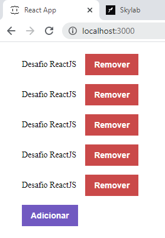

# bootcamp-conceitos-reactjs
Desafio inicial do Bootcamp da [Rocketseat](https://rocketseat.com.br/gostack) para aplicação dos conceitos fundamentais de ReactJS.

1. Conceitos ReactJS
2. Configurando Babel
3. Configurando Webpack
4. Componentização
5. Propriedades
6. Estado e Imutabilidade
7. Importando CSS e imagens
8. Integração com APIs

#### Instalação ####
1. `yarn install`

#### Execução ####
1. `yarn start`

#### Resultado ####

